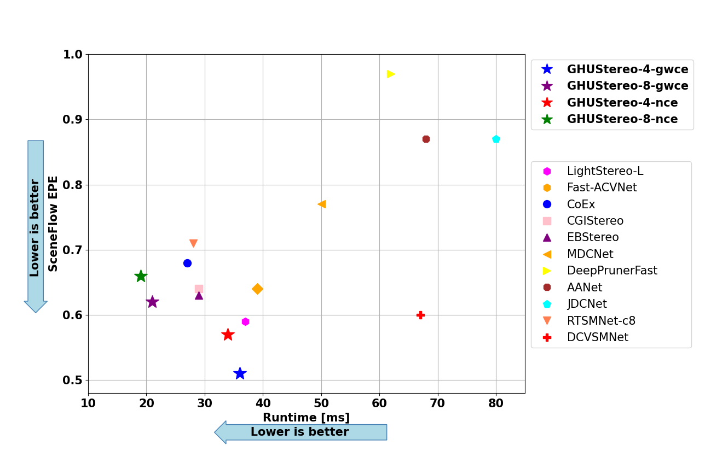

<p align="center">
  <h1 align="center">GLSFNet: Guided Hourglass Up-Sampling for Real-Time
and Efficient Stereo Matching</h1>
  <p align="center">
    Mahmoud Tahmasebi* (mahmoud.tahmasebi@research.atu.ie), Saif Huq, Kevin Meehan, Marion McAfee
  </p>
  <h3 align="center"><a href="TBD">Paper</a>
  <div align="center"></div>
</p>
<p align="center">
  <a href="">
    
  </a>
</p>


# Performance of GLSFNet-8-nce on KITTI raw dataset (46 FPS for the resolution of 380 x 1248 on RTX 4070)
<p align="center">
  
</p>

Performance on Jetson AGX Orin for low resolution input
<p align="center">
  
</p>

# SOTA results.
The results on SceneFlow

<p align="center"></p>


The results on KITTI dataset using RTX 4070.
| Method | KITTI 2012 <br> (3-noc) | KITTI 2012 <br> (3-all) | KITTI 2015 <br> (D1-bg) | KITTI 2015 <br> (D1-fg) | KITTI 2015 <br> (D1-all) |Runtime <br> (ms)|
|:-:|:-:|:-:|:-:|:-:|:-:|:-:|
| LightStereo-S | 1.88 % | 2.34 % | 2.00 % | 3.80 % | 2.30 % | 17 |
| RTSMNet | - | - | 3.44 % | 6.08 % | 3.88 % | 19 |
| HITNet | 1.41 % | 1.89 % | 1.74 % | 3.20 %| 1.98 % | 20 |
| CGI-Stereo | 1.41 % | 1.76 % | 1.66 % | 3.38 % | 1.94 % | 29 |
| CoEx | 1.55 % | 1.93 % | 1.79 % | 3.82 % | 2.13 % | 33 |
| LightStereo-L | 1.55 % | 1.87 % | 1.78 % | **2.64 %** | 1.93 % | 34 |
| BGNet+ | 1.62 % | 2.03 % | 1.81 % | 4.09 % | 2.19 % | 35 |
| Fast-ACVNet+ | 1.45 % | 1.85 % | 1.70 % | 3.53 % | 2.01 % | 45 |
| RT-IGEV++ | 1.29 % | 1.68 % | **1.48 %** | 3.37 % | 1.79 % | 48 |
| DispNetC | 4.11 % | 4.65 % | 2.21 % | 6.16 % | 4.43 % | 60 |
| AANet | 1.91 % | 2.42 % | 1.99 % | 5.39 % | 2.55 % | 62 |
| DCVSMNet | 1.30 % | 1.67 % | 1.60 % | 3.33 % | 1.89 % | 67 |
| JDCNet | 1.64 % | 2.11 % | 1.91 % | 4.47 % | 2.33 % | 80 |
| ------ | ------ | ------ | ------ | ------ | ------ | ------ |
| **GLSFNet-8-nce**| 1.74 % | 2.13 % | 1.92 % | 3.79 % | 2.23 % | 19 |
| **GLSFNet-4-nce**| 1.27 % | 1.67 % | **1.48 %** | 3.21 % | **1.77 %** | 34 |
| **GLSFNet-8-gwce**| 1.71 % | 2.08 % | 1.88 % | 3.34 % | 2.12 % | 21 |
| **GLSFNet-4-gwce**| **1.21 %** | **1.61 %** | 1.50 % | 3.64 % | 1.85 % | 36 |

# How to use

## Environment
* NVIDIA RTX 4070
* Python 3.11
* Pytorch 2.4.0

## Install

### Create a virtual environment and activate it.

```
conda create -n GLSFNet python=3.11
conda activate GLSFNet
```
### Dependencies

```
conda install pytorch torchvision torchaudio cudatoolkit=11.3 -c pytorch -c nvidia
pip install opencv-python
pip install scikit-image
pip install tensorboard
pip install matplotlib 
pip install tqdm
pip install timm==0.4.12
```

## Data Preparation
* [SceneFlow Datasets](https://lmb.informatik.uni-freiburg.de/resources/datasets/SceneFlowDatasets.en.html)
* [KITTI 2012](http://www.cvlibs.net/datasets/kitti/eval_stereo_flow.php?benchmark=stereo)
* [KITTI 2015](http://www.cvlibs.net/datasets/kitti/eval_scene_flow.php?benchmark=stereo)
* [Middlebury](https://vision.middlebury.edu/stereo/submit3/)

The structure of /datasets directory 

```shell
/datasets/
|-- ETH3D
|   |-- two_view_training
|   `-- two_view_training_gt
|-- Middlebury
|   |-- Eval3_GT
|   |-- MiddEval3-GT0-H
|   |-- MiddEval3-GT0-Q
|   |-- MiddEval3-data-H
|   |-- MiddEval3-data-Q
|   |-- testH
|   `-- trainingH
|-- SceneFlow
|   `-- flyingthings3d
|-- kitti_2012
|   |-- testing
|   `-- training
|-- kitti_2015
|   |-- testing
|   `-- training
|-- kittiraw2
|   |-- image_00
|   |-- image_01
|   |-- image_02
|   |-- image_03
|   |-- oxts
|   `-- velodyne_points
`-- vkitti
    |-- vkitti_depth
    `-- vkitti_rgb
```

## Train

Use the following command to train GLSFNet on SceneFlow.
First training,
```
python train_sceneflow.py --logdir ./checkpoints/sceneflow/first/ --cv_scale 4 --cv norm_correlation
```
Second training,
```
python train_sceneflow.py --logdir ./checkpoints/sceneflow/second/ --loadckpt ./checkpoints/sceneflow/first/checkpoint_000059.ckpt --cv_scale 4 --cv norm_correlation
```

Use the following command to finetune GLSFNet on KITTI using the pretrained model on SceneFlow,
```
python train_kitti.py --logdir ./checkpoints/kitti/ --loadckpt ./checkpoints/sceneflow/second/checkpoint_000059.ckpt --cv_scale 4 --cv norm_correlation
```


## Evaluation on SceneFlow and KITTI

### Pretrained Model
Download the trained weights folder and extract it in the root directory.
* [GLSFNet](https://drive.google.com/file/d/18KDTgUr2jGDQUQaf1Gbm5LJ1sCXHbskt/view?usp=drive_link)

Generate disparity images of KITTI test set,
```
python save_disp.py
```

Generalization on KITTI dataset,
```
python test_kitti.py --loadckpt ./checkpoint/ghustereo4_efficientnet_backbone_gwc.ckpt --cv_scale 4 --cv gwc
python test_kitti.py --loadckpt ./checkpoint/ghustereo8_efficientnet_backbone_gwc.ckpt --cv_scale 8 --cv gwc
python test_kitti.py --loadckpt ./checkpoint/ghustereo4_efficientnet_backbone_nc.ckpt --cv_scale 4 --cv norm_correlation
python test_kitti.py --loadckpt ./checkpoint/ghustereo8_efficientnet_backbone_nc.ckpt --cv_scale 8 --cv norm_correlation
```

# Citation

If you find this project helpful in your research, welcome to cite the paper.

```
@misc{tahmasebi2024dcvsmnet,
      title={GLSFNet: Guided Hourglass Up-Sampling for Real-Time and Efficient Stereo Matching}, 
      author={Mahmoud Tahmasebi and Saif Huq and Kevin Meehan and Marion McAfee},
      year={TBD},
      eprint={TBD},
      archivePrefix={TBD},
      primaryClass={cs.CV}
}
```

# Acknowledgements

Thanks to open source works: [CoEx](https://github.com/antabangun/coex), [ACVNet](https://github.com/gangweiX/Fast-ACVNet), [CGI-Stereo](https://github.com/gangweiX/CGI-Stereo), [OpenStereo](https://github.com/XiandaGuo/OpenStereo/tree/v2).
